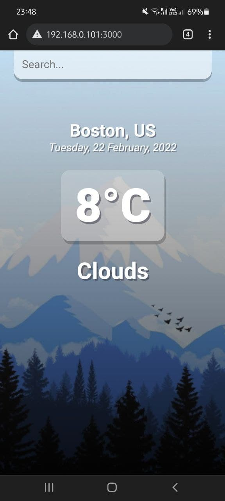
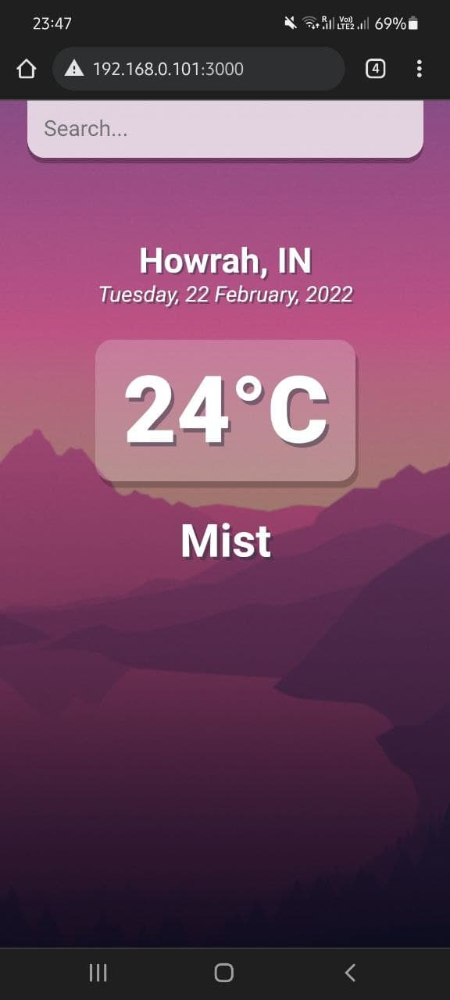

# Weather-App

Webapp to display *temperature* and *weather* condition of major cities around the world.
Uses **OpenWeatherMap** api to fetch the information based on given query.

## How to run : 

- In the project directory, you can run: `npm install` followed by `npm start` to start the server 
- Go to   `localhost:3000/` from any browser to use the app.

## Sample screenshot on mobile :

